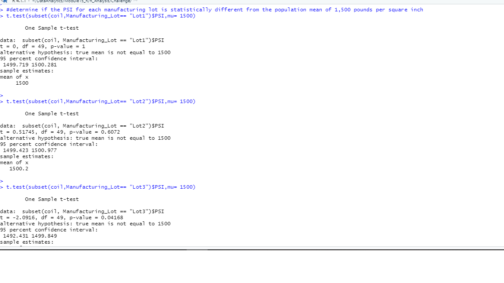

# MechaCar Statistical Analysis
## Purpose:
* Perform multiple linear regression analysis to identify which variables in the dataset predict the mpg of MechaCar prototypes
* Collect summary statistics on the pounds per square inch (PSI) of the suspension coils from the manufacturing lots
* Run t-tests to determine if the manufacturing lots are statistically different from the mean population
* Design a statistical study to compare vehicle performance of the MechaCar vehicles against vehicles from other manufacturers. For each statistical analysis, you’ll write a summary interpretation of the findings.

## Linear Regression to Predict MPG

1. Multiple Linear Regression Summary:
```
Coefficients:
                   Estimate Std. Error t value Pr(>|t|)    
(Intercept)      -1.040e+02  1.585e+01  -6.559 5.08e-08 ***
vehicle_length    6.267e+00  6.553e-01   9.563 2.60e-12 ***
vehicle_weight    1.245e-03  6.890e-04   1.807   0.0776 .  
spoiler_angle     6.877e-02  6.653e-02   1.034   0.3069    
ground_clearance  3.546e+00  5.412e-01   6.551 5.21e-08 ***
AWD              -3.411e+00  2.535e+00  -1.346   0.1852    
---
Signif. codes:  0 ‘***’ 0.001 ‘**’ 0.01 ‘*’ 0.05 ‘.’ 0.1 ‘ ’ 1

Residual standard error: 8.774 on 44 degrees of freedom
Multiple R-squared:  0.7149,	Adjusted R-squared:  0.6825 
F-statistic: 22.07 on 5 and 44 DF,  p-value: 5.35e-11
```
2. Key Findings:

* The results show that vehicle_length, vehicle_weight and ground_clearance variables/coefficients provided a non-random amount of variance to the mpg values in the dataset.
* Th slope of the linear model is not considered to be zero because p-value is much less than the significance level 0.05.
* The linear model predict mpg of MechaCar prototypes effectively because r-squared value is 0.7 which indicated a strong positive realtionship between the car variables and mpg.

## Summary Statistics on Suspension Coils
As the design specifications for the MechaCar suspension coils dictate that the variance of the suspension coils must not exceed 100 pounds per square inch, the following results shows current manufacturing data conformance to this design specification for all manufacturing lots in total and each lot individually:

Mean | Median | Variance | SD |Conformance | Rationale 
---- | ------ | -------- | ---| ------------|---
1498.78 |1500 | 62.29356 | 7.892627| Yes | Variance does not exceed 100 pounds per square inch

Drilling down to the individual manufacturing lots, the results shows variance of 170 for Lot 3 which does not conform to the standard. Lot 1 and 2 conform to the standard with variance of 0.97 and 7.47 respectively.

## T-Tests on Suspension Coils
The t-test for PSI across all manufacturing lots showed that it is not statistically different from the population mean of 1,500 pounds per square inch as the p-value is 0.06 which is higher than the significance level (0.05).

T-test result for different manufacturing lots:


Lot1 and Lot2 means are statistically  similar to the population's mean.
Lot3 mean is statistically different from the population mean.


